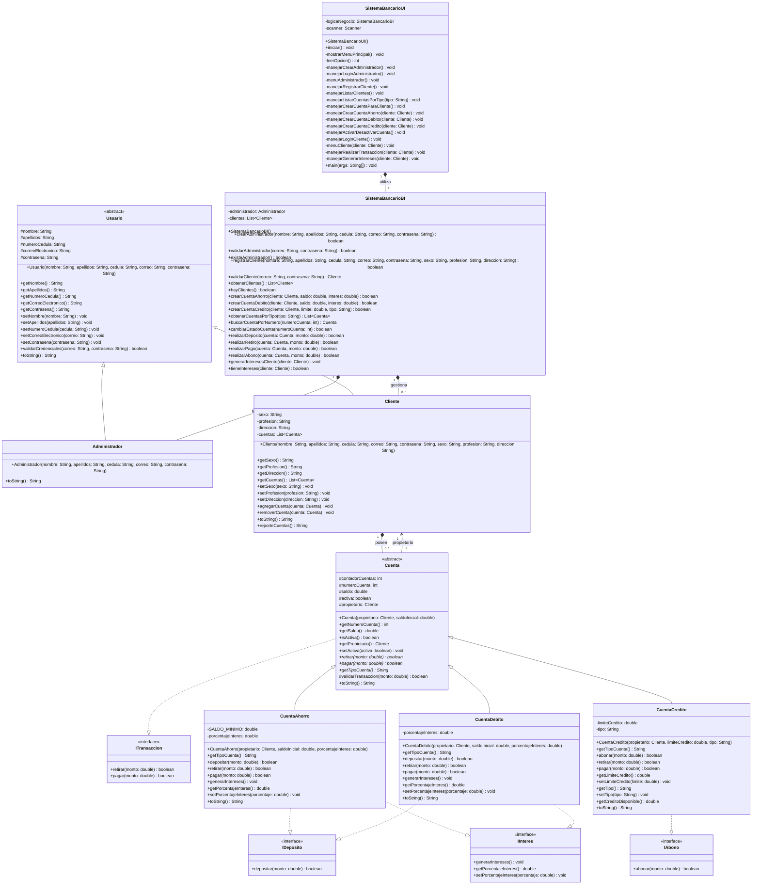

# Diagrama UML - Sistema Bancario Final

## Diagrama de Clases

## Descripción de Relaciones

### Herencia
- **Usuario** (abstracta) ← **Administrador**, **Cliente**
- **Cuenta** (abstracta) ← **CuentaAhorro**, **CuentaDebito**, **CuentaCredito**

### Implementación de Interfaces
- **Cuenta** implementa **ITransaccion**
- **CuentaAhorro** implementa **IDeposito** e **IInteres**
- **CuentaDebito** implementa **IDeposito** e **IInteres**
- **CuentaCredito** implementa **IAbono**

### Composición/Agregación
- **Cliente** posee múltiples **Cuenta** (0..*)
- **Cuenta** tiene un **Cliente** propietario (1)
- **SistemaBancarioBI** gestiona un **Administrador** (0..1) y múltiples **Cliente** (0..*)
- **SistemaBancarioUI** utiliza **SistemaBancarioBI** (1)

### Arquitectura Modular
- **SistemaBancarioBI**: Capa de Business Intelligence (lógica de negocio)
- **SistemaBancarioUI**: Capa de User Interface (interfaz de usuario)

## Patrones de Diseño Implementados

1. **Template Method**: En la clase abstracta `Cuenta` con métodos abstractos
2. **Strategy**: A través de las interfaces para diferentes tipos de operaciones
3. **Composition**: Cliente contiene lista de cuentas
4. **Separation of Concerns**: Separación entre lógica de negocio (BI) y presentación (UI)

## Principios SOLID Aplicados

- **S**: Cada clase tiene una responsabilidad específica
- **O**: Extensible a través de herencia e interfaces
- **L**: Las subclases pueden sustituir a sus clases base
- **I**: Interfaces segregadas por funcionalidad específica
- **D**: Dependencia de abstracciones, no de implementaciones concretas